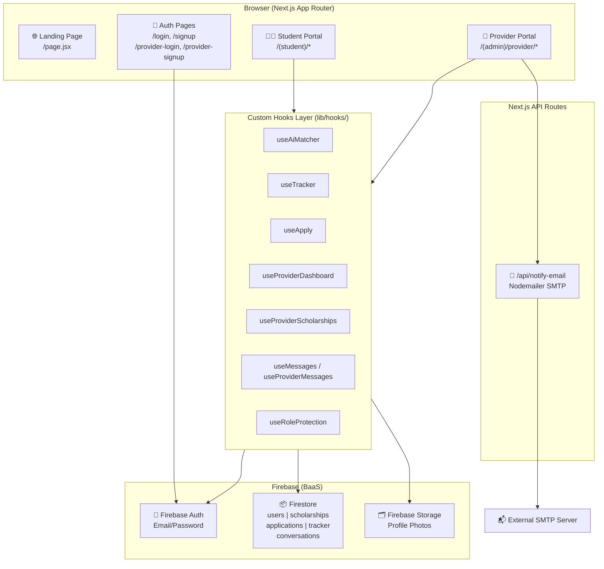
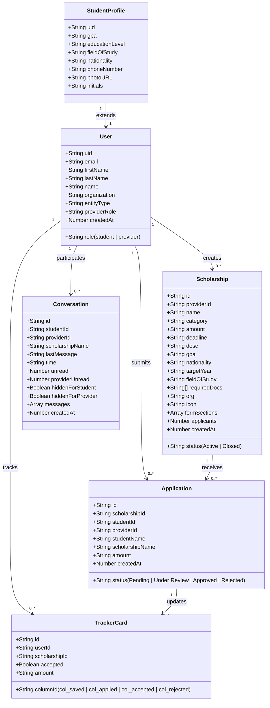

# 🎓 ScholarQuest

> **An AI-powered scholarship discovery and management platform** connecting ambitious students with companies, universities, and institutions that fund their futures — all in one place.

---

## 📖 Description

ScholarQuest is a full-stack web application that bridges the gap between **scholarship seekers (students)** and **scholarship providers (companies, universities, NGOs)**. Students can discover scholarships tailored to their profile through an AI matching engine, track their applications on a Kanban board, and communicate directly with providers. Providers get a complete portal to create scholarships, review applications, and measure their impact through rich analytics dashboards.

---

## ❓ Why ScholarQuest? — Problem It Solves

| Problem | How ScholarQuest Solves It |
|---|---|
| Students spend **weeks searching** across hundreds of websites for relevant scholarships | AI Matcher instantly surfaces top-match scholarships based on the student's profile, GPA, field of study, and nationality |
| Application statuses are scattered across emails and portals | A **Kanban tracker board** organises every application into columns: Saved → Applied → Under Review → Accepted / Rejected |
| Companies have no dedicated tool to **manage CSR/scholarship programs** | Providers get a full-featured portal to post scholarships with custom application forms, review candidates, and track impact |
| Students and providers have **no direct communication channel** | Built-in **real-time messaging** system with conversation threads tied to specific scholarships |
| Providers lack **data insights** on their scholarship programs | Rich analytics dashboards (application trends, category breakdowns, match-score distributions, approval rates) |
| Email notifications are manual and unreliable | Automated email notifications (via Nodemailer API route) sent whenever a new scholarship is posted |

---

## ✨ Features

### 👩‍🎓 Student Portal
- **AI Scholarship Matcher** — Chat-based interface that recommends scholarships by keyword (STEM, Graduate, AI, etc.)
- **Scholarship Discovery** — Browse and filter all active scholarships by category, amount, and deadline
- **One-click Apply** — Custom application forms built by each provider, submitted directly to Firestore
- **Kanban Application Tracker** — Drag-free visual board to track every application through its lifecycle
- **Application Status** — Real-time status updates (Pending → Under Review → Approved / Rejected)
- **Student Profile & Onboarding** — GPA, education level, field of study, nationality, and profile photo
- **Real-time Messaging** — Chat with providers directly from the platform
- **Notifications** — In-app alerts for status changes and new scholarships
- **Analytics Overview** — Personal funding trends and application outcome charts
- **Help Center** — FAQ and support page

### 🏢 Provider Portal
- **Partner Registration & Login** — Dedicated auth flow for companies and institutions
- **Scholarship Creator** — Multi-section form builder with custom questions, eligibility filters (GPA, nationality, year, field of study), required documents, and deadline management
- **Application Manager** — Review all submissions, approve or reject with one click (auto-updates the student's Kanban board)
- **Real-time Dashboard KPIs** — Allocated funds, scholarships posted, active submissions, approval rate
- **Advanced Analytics Charts:**
  - Monthly application trends
  - Category breakdown (pie)
  - Education level distribution
  - Match score distribution
  - Status breakdown
  - Top programs by applicant count
  - Monthly overview chart
- **Provider Messaging** — Reply to student enquiries per scholarship
- **Reports Page** — Aggregated impact report
- **Settings** — Account and organisation management
- **Auto-Message on Post** — When a new scholarship is created, every registered student automatically receives a direct message about it

### 🌐 Public / Landing Page
- Animated hero landing page
- Success stories section
- Navigation with student and provider entry points

---

## 🛠️ Tech Stack

### Core Framework — **Next.js 16 (App Router)**
> **Why:** Next.js App Router enables server components, nested layouts, and file-system-based routing out of the box. The `(admin)` and `(student)` route groups allow completely isolated layouts (sidebar, auth guards) for providers and students without any routing boilerplate. API routes (`/app/api/`) handle server-side tasks like sending emails without a separate backend server.

### UI Library — **React 19**
> **Why:** React's component model and hooks (`useState`, `useEffect`, `useRef`) allow encapsulating all business logic into **custom hooks** (`useProviderDashboard`, `useAiMatcher`, `useTracker`, etc.), keeping pages thin and testable. React 19's concurrent features improve perceived performance on data-heavy dashboard pages.

### Styling — **Tailwind CSS v4**
> **Why:** Tailwind's utility-first approach paired with a custom design token system (defined in `@theme` inside `globals.css`) creates a consistent design language across the entire application — two completely different portals (student purple/pink theme vs. provider indigo/clean theme) share the same utility classes but swap CSS variables via `.theme-admin`.

### Backend-as-a-Service — **Firebase (v12)**
> **Why:** Firebase removes the need for a dedicated backend server while providing production-grade infrastructure:

| Firebase Service | Usage in ScholarQuest |
|---|---|
| **Firebase Auth** | Email/password auth for both students and providers. `onAuthStateChanged` listener drives role-based protection via `useRoleProtection` hook |
| **Firestore** | NoSQL real-time database. Collections: `users`, `scholarships`, `applications`, `tracker`, `conversations`. `onSnapshot` listeners power live dashboard KPIs and messaging |
| **Firebase Storage** | Profile photo uploads for students |

### Animations — **Framer Motion v12**
> **Why:** Used on the landing page and key interactive components (hero section, success stories) to add entrance animations, scroll-triggered transitions, and micro-interactions that elevate the visual experience without writing manual CSS keyframes.

### Email Notifications — **Nodemailer v9**
> **Why:** A Next.js API Route (`/api/notify-email`) acts as a lightweight email server using Nodemailer. When providers post new scholarships, this route dispatches notification emails — keeping the feature server-side without exposing SMTP credentials to the client.

### Phone Input — **react-phone-number-input v3**
> **Why:** Provides a standardised, internationally-formatted phone number input with built-in country flag selectors during student onboarding — significantly better UX than a plain text field.

### Icons — **Material Symbols Outlined (Google Fonts)**
> **Why:** Variable icon font loaded via CDN with `FILL`, `wght`, `GRAD`, and `opsz` axes — allowing filled or outlined variants of the same icon via a single CSS property change (`font-variation-settings`), keeping the icon bundle to a single font file.

### Typography — **Inter + Manrope (Google Fonts)**
> **Why:** Inter is the industry standard for data-dense UI (dashboards, forms). Manrope is used exclusively for headings to provide a distinct, premium feel with its geometric construction. Both are loaded via `next/font/google` for optimal performance and zero layout shift.

---

## 🏗️ System Architecture



---

## 📐 Class Diagram



---

## 🔄 Application Flow Diagram

```mermaid
flowchart TD
    A([User visits ScholarQuest]) --> B{Has Account?}
    B -->|No - Student| C[/signup]
    B -->|No - Provider| D[/provider-signup]
    B -->|Yes - Student| E[/login]
    B -->|Yes - Provider| F[/provider-login]

    C --> G[Firebase Auth: createUser]
    D --> G
    E --> H[Firebase Auth: signIn]
    F --> H

    G --> I{Role?}
    H --> I

    I -->|student| J["Student Portal /(student)/*"]
    I -->|provider| K["Provider Portal /(admin)/provider/*"]

    J --> J1[Dashboard]
    J --> J2[AI Matcher Chat]
    J --> J3[Discovery / Browse]
    J --> J4[Kanban Tracker]
    J --> J5[Messaging]

    J3 --> J3a[Browse Scholarships]
    J3a --> J3b[View Detail]
    J3b --> J3c[Apply → Firestore: applications]
    J3c --> J4a[Tracker card auto-created]

    K --> K1[Dashboard KPIs]
    K --> K2[Post New Scholarship]
    K --> K3[Review Applications]
    K --> K5[Analytics Reports]
    K --> K6[Messaging]

    K2 --> K2a[Firestore: scholarships]
    K2a --> K2b[Auto-message all students]
    K2a --> K2c[Email via /api/notify-email]

    K3 --> K3a{Approve or Reject?}
    K3a -->|Approve| K3b[Firestore: applications.status = Approved]
    K3a -->|Reject| K3c[Firestore: applications.status = Rejected]
    K3b --> K3d[Tracker card moved to col_accepted]
    K3c --> K3e[Tracker card moved to col_rejected]
```

---

## 📁 Project Structure

```
ScholarQuest/
├── app/                          # Next.js App Router root
│   ├── layout.jsx                # Root layout: fonts (Inter, Manrope), Material Symbols, global CSS
│   ├── globals.css               # Design token system (@theme), admin theme override, utilities
│   ├── page.jsx                  # Public landing page (hero, features, success stories)
│   │
│   ├── login/                    # Student sign-in page
│   ├── signup/                   # Student registration page
│   ├── provider-login/           # Provider sign-in page
│   ├── provider-signup/          # Provider registration page (split-panel premium UI)
│   ├── help/                     # Public help / FAQ page
│   │
│   ├── (student)/                # Route group: Student Portal (isolated layout + auth guard)
│   │   ├── layout.jsx            # Student shell: sidebar, top header, mobile nav, role protection
│   │   ├── dashboard/            # Student home dashboard
│   │   ├── ai-matcher/           # AI chat interface for scholarship recommendations
│   │   ├── discovery/            # Browse & search all scholarships
│   │   ├── scholarships/         # Scholarship detail pages
│   │   ├── apply/                # Application submission form (dynamic per scholarship)
│   │   ├── application-status/   # View submitted application statuses
│   │   ├── tracker/              # Kanban board — track applications lifecycle
│   │   ├── messages/             # Real-time student ↔ provider messaging
│   │   ├── onboarding/           # Profile setup wizard (first-time users)
│   │   └── profile/              # Student profile edit page
│   │
│   ├── (admin)/                  # Route group: Provider Portal (isolated layout + auth guard)
│   │   └── provider/
│   │       ├── page.jsx          # Provider dashboard (KPIs + recent applications)
│   │       ├── scholarships/     # List + manage scholarships
│   │       │   └── new/          # Scholarship creation form (multi-section builder)
│   │       ├── applications/     # Review all student applications
│   │       ├── messages/         # Provider ↔ student conversations
│   │       ├── reports/          # Aggregated impact reports
│   │       └── settings/         # Account & organisation settings
│   │
│   └── api/
│       └── notify-email/         # Next.js API Route: Nodemailer SMTP email sender
│
├── components/
│   ├── layout/
│   │   ├── Navbar.jsx            # Public landing page navigation
│   │   ├── Footer.jsx            # Public footer
│   │   ├── StudentSidebar.jsx    # Student portal left nav (links, user info, logout)
│   │   ├── ProviderSidebar.jsx   # Provider portal left nav
│   │   └── MobileBottomNav.jsx   # Mobile bottom tab bar for students
│   │
│   ├── dashboard/
│   │   ├── ProviderApplicationTrends.jsx     # Line chart: apps over time
│   │   ├── ProviderCategoryBreakdown.jsx     # Pie chart: scholarship categories
│   │   ├── ProviderEducationLevelChart.jsx   # Bar chart: applicant education levels
│   │   ├── ProviderMatchScoreDistribution.jsx# Histogram: AI match scores
│   │   ├── ProviderMonthlyActivity.jsx       # Monthly activity heatmap/bar
│   │   ├── ProviderMonthlyOverviewChart.jsx  # Multi-series monthly overview
│   │   ├── ProviderStatusBreakdown.jsx       # Donut: application status split
│   │   ├── ProviderTopPrograms.jsx           # Table: top scholarships by applicants
│   │   ├── StudentAnalyticsOverview.jsx      # Student KPI overview cards
│   │   ├── StudentApplicationOutcomes.jsx    # Student outcome breakdown chart
│   │   └── StudentFundingTrends.jsx          # Student funding over time chart
│   │
│   ├── sections/
│   │   └── SuccessStoriesSection.jsx         # Landing page testimonials carousel
│   │
│   └── react-bits/                           # Reusable animated UI primitives
│
├── lib/
│   ├── firebase.js               # Firebase app init + exports (auth, db, storage)
│   ├── gpaConverter.js           # GPA scale conversion utility
│   ├── store.js                  # Global Zustand-style state store
│   └── hooks/                    # All custom React hooks (business logic layer)
│       ├── useLogin.js           # Student sign-in logic + redirect
│       ├── useSignup.js          # Student registration + Firestore profile creation
│       ├── useProviderLogin.js   # Provider sign-in logic
│       ├── useProviderSignup.js  # Provider registration + Firestore org profile
│       ├── useRoleProtection.js  # Auth guard: redirects wrong-role users
│       ├── useUserRole.js        # Reads current user's role from Firestore
│       ├── useOnboarding.js      # Student profile setup wizard state
│       ├── useProfile.js         # Student profile read/write
│       ├── useDiscovery.js       # Scholarship browsing, filtering, searching
│       ├── useScholarshipDetail.js # Single scholarship data + eligibility check
│       ├── useApply.js           # Application submission form handler
│       ├── useTracker.js         # Kanban board state, drag logic, Firestore sync
│       ├── useAiMatcher.js       # AI chat engine: keyword matching → scholarship cards
│       ├── useMessages.js        # Student messaging (read/send conversations)
│       ├── useNotifications.js   # In-app notification feed
│       ├── useProviderDashboard.js      # Provider KPIs, quick approve/reject, live listeners
│       ├── useProviderScholarships.js   # Provider scholarship list management
│       ├── useProviderNewScholarship.js # Multi-section scholarship form builder + submit
│       ├── useProviderApplications.js   # Full application review + status update
│       ├── useProviderMessages.js       # Provider conversation management
│       └── useProviderSettings.js      # Provider settings page state
│
├── public/                       # Static assets (logos, hero images, icons)
├── .env                          # Firebase config + SMTP secrets (gitignored)
├── next.config.mjs               # Next.js configuration
├── tailwind.config               # Tailwind v4 (config in globals.css @theme)
└── package.json                  # Dependencies and scripts
```

---

## 🚀 Getting Started

### Prerequisites
- Node.js 18+
- A Firebase project with **Auth**, **Firestore**, and **Storage** enabled
- An SMTP email account (Gmail App Password recommended)

### Installation

```bash
# 1. Clone the repository
git clone https://github.com/Sridharn97/ScholarQuest.git
cd ScholarQuest/ScholarQuest

# 2. Install dependencies
npm install

# 3. Configure environment variables
cp .env.example .env
# Fill in your Firebase config and SMTP credentials in .env

# 4. Start the development server
npm run dev
```

Open [http://localhost:3000](http://localhost:3000) in your browser.

### Environment Variables

```env
NEXT_PUBLIC_FIREBASE_API_KEY=
NEXT_PUBLIC_FIREBASE_AUTH_DOMAIN=
NEXT_PUBLIC_FIREBASE_PROJECT_ID=
NEXT_PUBLIC_FIREBASE_STORAGE_BUCKET=
NEXT_PUBLIC_FIREBASE_MESSAGING_SENDER_ID=
NEXT_PUBLIC_FIREBASE_APP_ID=
NEXT_PUBLIC_FIREBASE_MEASUREMENT_ID=

SMTP_USER=your-email@gmail.com
SMTP_PASS=your-app-password
```

### Scripts

| Command | Description |
|---|---|
| `npm run dev` | Start development server with Turbopack |
| `npm run build` | Build production bundle |
| `npm run start` | Start production server |
| `npm run lint` | Run ESLint |

---

## 🔐 Role-Based Access

ScholarQuest uses Firebase Auth + Firestore to implement role-based access control:

```
/login          → authenticates → role: "student" → redirects to /(student)/dashboard
/provider-login → authenticates → role: "provider" → redirects to /(admin)/provider
```

Every protected route calls `useRoleProtection(expectedRole)` which:
1. Listens for the Firebase Auth state
2. Reads the `role` field from `Firestore/users/{uid}`
3. Redirects to the correct portal if the role doesn't match
4. Returns `true` (auth checked) only when the role is verified — preventing content flash

---

## 👥 User Roles Summary

| Role | Entry Point | Key Collections |
|---|---|---|
| **Student** | `/signup` → `/(student)/*` | `users`, `applications`, `tracker`, `conversations` |
| **Provider** | `/provider-signup` → `/(admin)/provider/*` | `users`, `scholarships`, `applications`, `conversations` |
