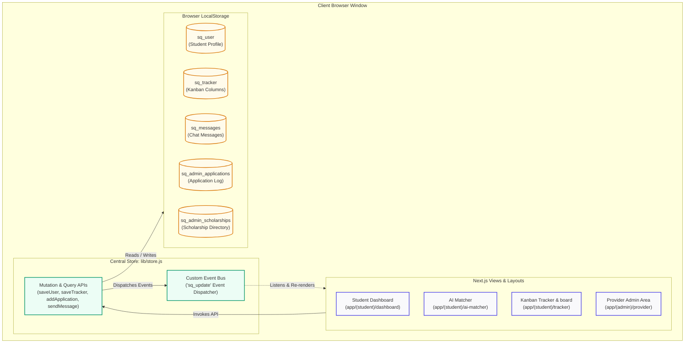
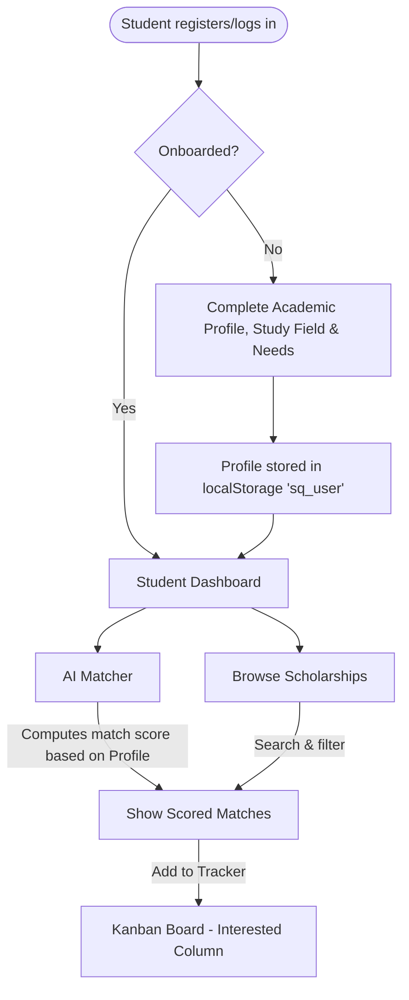
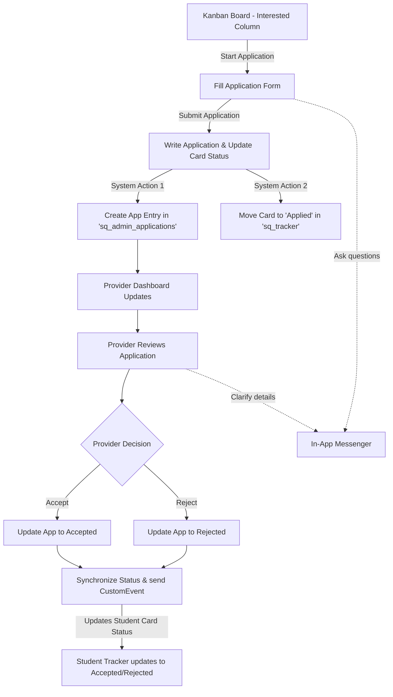

# ScholarQuest 🎓✨

[](https://nextjs.org/)
[](https://react.dev/)
[](https://tailwindcss.com/)

**ScholarQuest** is a comprehensive, client-reactive scholarship discovery, matching, and application management portal. It connects **Students** looking for funding opportunities with **Sponsors & Institutional Providers** posting and screening applicants. 

---

## 🛠️ Tech Stack

ScholarQuest is built using a modern, lightweight, and high-performance client-side technology stack:

* **Framework**: [Next.js v16.2.7](https://nextjs.org/) (using App Router for layouts and page rendering).
* **Core View Engine**: [React v19.2.7](https://react.dev/) (dynamic client-side components and custom lifecycle hooks).
* **Styling**: [Tailwind CSS v4.0](https://tailwindcss.com/) & PostCSS (fully responsive design system with a premium, custom-colored palette).
* **Input Validation**: [React Phone Number Input v3.4.17](https://github.com/catamphetamine/react-phone-number-input) (formatted and validated phone fields).
* **State & Persistence**: Centralized reactive Store ([`lib/store.js`](file:///c:/Users/Sridhar/Desktop/ScholarQuest/ScholarQuest/lib/store.js)) using **HTML5 LocalStorage** and a custom Event Bus dispatch system.

---

## 🏗️ System Architecture

ScholarQuest uses a decoupled, frontend-centric architecture utilizing Next.js App Router. State is maintained inside a centralized localStorage database with an reactive event bus system. This enables multi-tab synchronization and reactivity without a server-side DB.



---

## 🔄 User & Data Workflows

### 1. Student Onboarding & Discovery Flow


### 2. Application & Provider Review Lifecycle


---

## 📂 Codebase & Directories Tour

Click on any of the core components and files below to view their contents:

- **Central State Engine**: 
  - [`lib/store.js`](file:///c:/Users/Sridhar/Desktop/ScholarQuest/ScholarQuest/lib/store.js) — Houses all core data access operations, auth mechanisms, Kanban card shifts, messaging APIs, and reactive triggers.
  
- **Student Layout & Views (`app/(student)`)**:
  - [`layout.jsx`](file:///c:/Users/Sridhar/Desktop/ScholarQuest/ScholarQuest/app/(student)/layout.jsx) — Layout configuration for students. Includes responsive sidebar navigation.
  - [`dashboard/page.jsx`](file:///c:/Users/Sridhar/Desktop/ScholarQuest/ScholarQuest/app/(student)/dashboard/page.jsx) — Displays student stats, recent match activity, profile status, and quick links.
  - [`ai-matcher/page.jsx`](file:///c:/Users/Sridhar/Desktop/ScholarQuest/ScholarQuest/app/(student)/ai-matcher/page.jsx) — Evaluates student profiles against active scholarship terms to offer ranked percent matches.
  - [`tracker/page.jsx`](file:///c:/Users/Sridhar/Desktop/ScholarQuest/ScholarQuest/app/(student)/tracker/page.jsx) — Kanban Board implementing drag-and-drop workflow tracking for scholarship application cards.
  - [`apply/[id]/page.jsx`](file:///c:/Users/Sridhar/Desktop/ScholarQuest/ScholarQuest/app/(student)/apply/[id]/page.jsx) — Form-based portal for student application submissions.
  - [`messages/page.jsx`](file:///c:/Users/Sridhar/Desktop/ScholarQuest/ScholarQuest/app/(student)/messages/page.jsx) — Direct messaging interface with program managers.

- **Provider Admin Views (`app/(admin)`)**:
  - [`layout.jsx`](file:///c:/Users/Sridhar/Desktop/ScholarQuest/ScholarQuest/app/(admin)/layout.jsx) — Sidebar and shell styling for the admin panel.
  - [`provider/page.jsx`](file:///c:/Users/Sridhar/Desktop/ScholarQuest/ScholarQuest/app/(admin)/provider/page.jsx) — Provider landing page with key statistics (total funding disbursed, average GPA of applicants).
  - [`provider/applications/page.jsx`](file:///c:/Users/Sridhar/Desktop/ScholarQuest/ScholarQuest/app/(admin)/provider/applications/page.jsx) — Applicant management log allowing status changes and messaging triggers.
  - [`provider/scholarships/page.jsx`](file:///c:/Users/Sridhar/Desktop/ScholarQuest/ScholarQuest/app/(admin)/provider/scholarships/page.jsx) — Section to add, review, and modify scholarships.
  - [`provider/settings/page.jsx`](file:///c:/Users/Sridhar/Desktop/ScholarQuest/ScholarQuest/app/(admin)/provider/settings/page.jsx) — Organization detail configuration.

- **Global Navigation & Common Utilities**:
  - [`components/layout/Navbar.jsx`](file:///c:/Users/Sridhar/Desktop/ScholarQuest/ScholarQuest/components/layout/Navbar.jsx) — Main landing page navigation.
  - [`components/layout/Footer.jsx`](file:///c:/Users/Sridhar/Desktop/ScholarQuest/ScholarQuest/components/layout/Footer.jsx) — Application footer.

---

## ⚡ Technical Highlights

1. **Event-Driven Reactivity**: Instead of relying on full-page refreshes or polling, mutations inside [`store.js`](file:///c:/Users/Sridhar/Desktop/ScholarQuest/ScholarQuest/lib/store.js) dispatch a `sq_update` Event. Views subscribe to this event inside `useEffect` to capture data changes in real-time.
2. **AI Matching Core**: The system weights student criteria (GPA, field of study, financial requirement) against scholarship qualifications dynamically, computing an alignment percentage.
3. **Responsive Sidebars & Navs**: Built-in support for desktop sidebars and mobile bottom navigation toggles, rendering correctly on multiple screen sizes.

---

## 🚀 Getting Started

### Prerequisites

You need [Node.js](https://nodejs.org/) (v18+) installed.

### Setup and Start

1. **Install dependencies**:
   ```bash
   npm install
   ```

2. **Run the development server**:
   ```bash
   npm run dev
   ```

3. **Build the production application**:
   ```bash
   npm run build
   npm run start
   ```

Open [http://localhost:3000](http://localhost:3000) inside your web browser to explore.

---

## 🔑 Access Credentials

To test the application locally without creating new accounts, you can use these mock logins:

| User Type | Email | Password | Role |
|---|---|---|---|
| **Student** (Pre-populated) | Use registration or any mock details | `any` | Applicant |
| **Provider / Sponsor** | `provider@scholarquest.io` | `provider123` | Sponsor Coordinator (Global Tech Foundation) |
| **Provider (Program Manager)** | `admin@admin.com` | `admin123` | Program Manager (ScholarQuest Institute) |

---
*ScholarQuest — Empowering academic journeys through smart search and automation.*
